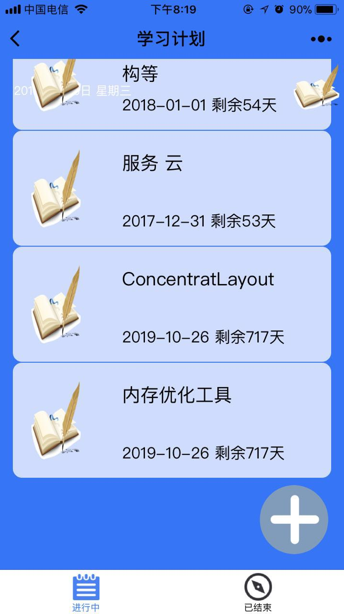
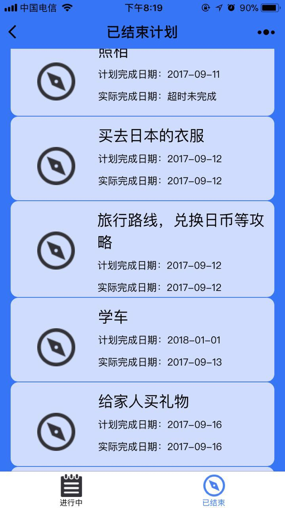

# 微信小程序-学习计划表
  
一个用来学习微信小程序的工程  
1.做了一个用来记录学习计划的工具，点击+可以添加新的学习计划，填写计划和完成时间。  
2.在学习中列表显示正在进行中的计划，提醒每个计划的剩余时间，点击计划，会出下拉菜单，选择计划完成和放弃计划，修改计划的状态。  
3.当计划完成或者超时时，会显示在已结束列表中，列表会显示完成还是超时。 
  

进行中  
  
已结束  
 
